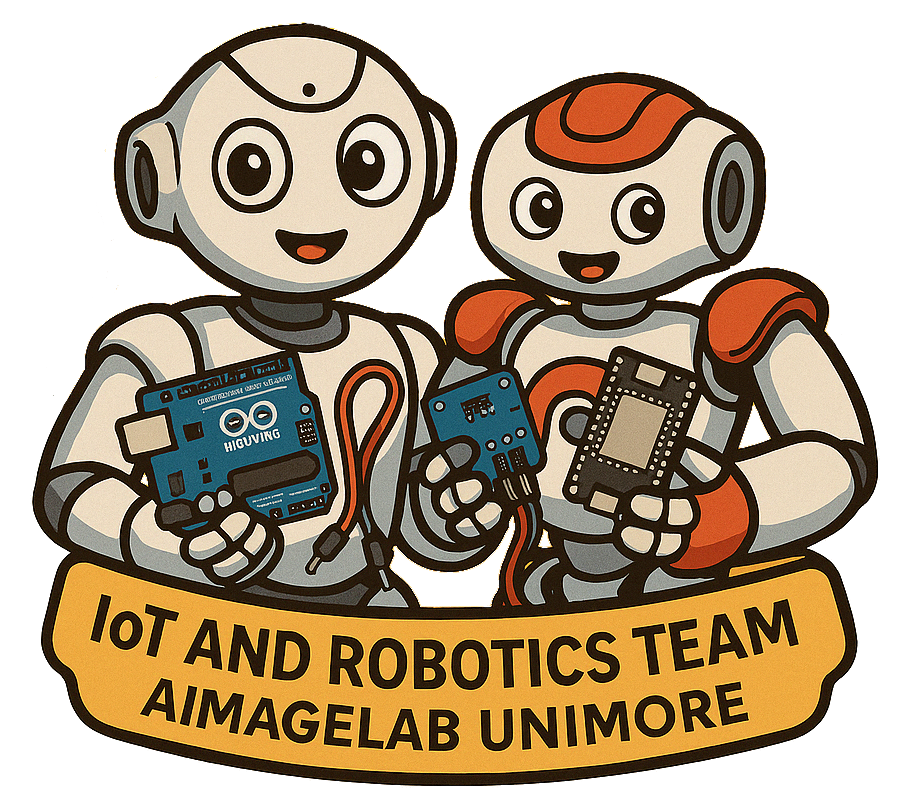

# LLMs as NAO Robot 3D Motion Planners

[](https://iris.unimore.it/retrieve/320173f0-7f6e-4a62-ad1e-93be3acdc292/2025247674.pdf)


🤖 This is the official repository for the paper **"LLMs as NAO Robot 3D Motion Planners"** presented at the 2025 IEEE/CVF International Conference on Computer Vision (ICCVW) Workshop of Assistive Computer Vision and Robotics (ACVR), Honolulu, United States. 🌺



> 🙋 **Authors:** Riccardo Catalini*, Giacomo Salici* ✉️, Federico Biagi, Guido Borghi, Luigi Biagiotti, Roberto Vezzani.  
> 🏫 **University of Modena and Reggio Emilia**  
> 📬 `name.surname@unimore.it`


## 📋 Abstract

This study demonstrates the capabilities of state-of-the-art Large Language Models (LLMs) in teaching social robots to perform specific actions within a 3D environment. We introduce the use of LLMs to generate sequences of 3D joint angles – in both zero-shot and one-shot prompting – that a humanoid robot must follow to perform a given action. This work is driven by the growing demand for intuitive interactions with social robots, empowering non-expert users to operate and benefit from robotic systems effectively.

We evaluated seven different LLMs (ChatGPT-4o, LLaMA 3.3 70B, LLaMA 4 Maverick, Gemini 2.0 Flash, Claude 3.7 Sonnet, DeepSeek-V3, and Qwen 2.5 Max) through a blind user study with over 50 participants, generating more than 2,000 responses. The results highlight that the majority of LLMs are capable of planning correct and complete recognizable actions for the NAO robot.

### 🎯 Key Features

- Demonstration that LLMs have the capability of addressing the motion generation task.
- Comparative evaluation of seven LLMs generating NAO joint sequences in zero-shot and one-shot prompting
- Generation of synthetic data consisting of different robot’s poses
- Large-scale blind study: participants watched NAO videos, identified actions, and chose best matches across models, enabling statistical comparisons.


### 🔬 Research Questions Addressed

**RQ1: Can LLMs effectually generate NAO robot actions?**  
✅ Yes, modern LLMs demonstrate effective capability for this task, with actions being readily recognizable in most cases.

**RQ2: How does the prompting strategy affect action generation?**  
✅ One-shot prompting generally yields better results, particularly in reducing failure cases and improving motion stability.

**RQ3: What causes variations in LLM-generated robot actions?**  
✅ Variations stem from differences in parameter count, context window handling, and internal representation of physical dynamics.


## 🏗️ Repository Structure

```
/
├── web/                    # Web application for interaction and visualization
├── prompts/                # Generated model control prompts
├── media/                  # Images and videos for documentation
└── README.md               # This file
```

## 📖 Citation

If you use this work in your research, please cite:

```bibtex
@inproceedings{catalini2025llms,
  title={LLMs as NAO Robot 3D Motion Planners},
  author={Catalini, Riccardo and Salici, Giacomo and Biagi, Federico and Borghi, Guido and Biagiotti, Luigi and Vezzani, Roberto},
  booktitle={2025 IEEE/CVF International Conference on Computer Vision Workshops (ICCVW)},
  year={2025},
  location={Honolulu, United States}
}
```

